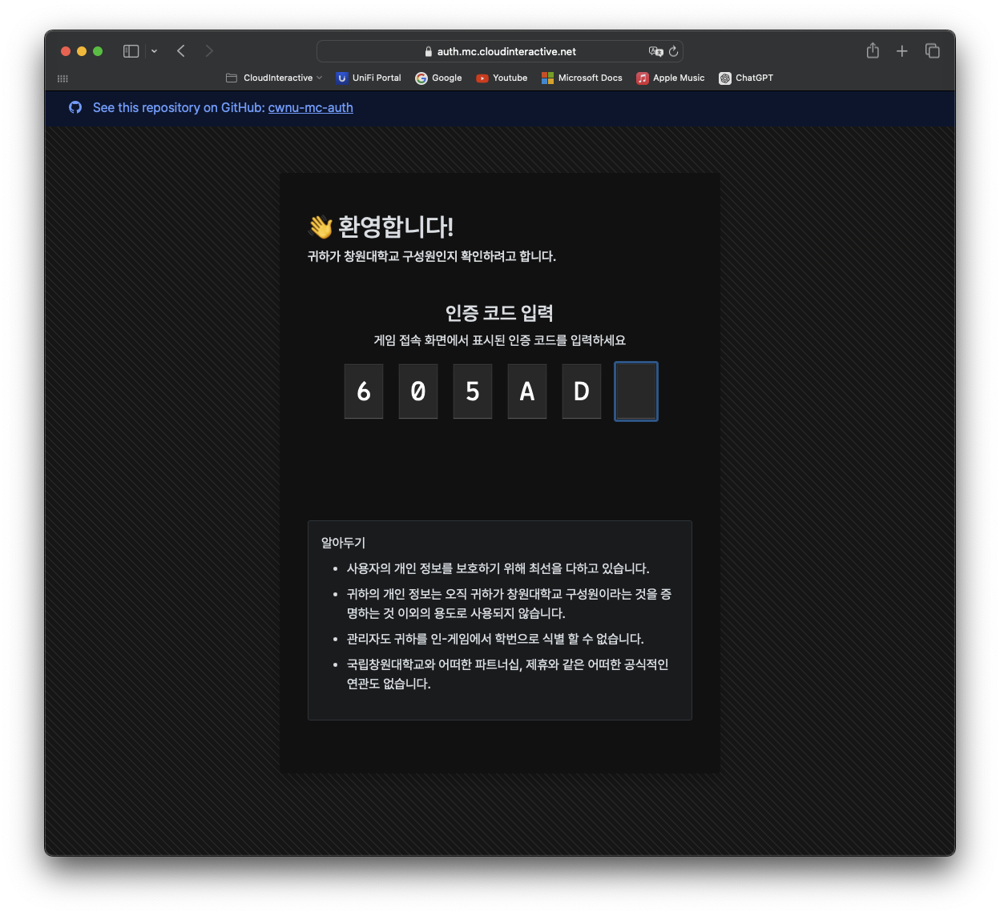

# MC-WebAuth
 
  

**cwnu-mc-auth 프로젝트가 MC-WebAuth로 명칭이 변경되었습니다**
>[!NOTE]
>**Currently, this project is only available in Korean (국문).**
>
>English may be supported in the future release.

Minecraft Spigot 기반 서버를 위한 외부 인증 서버 프로젝트 입니다.

외부 데이터베이스를 통해 Minecraft Spigot 기반 서버에서 쉽게 사용자를 인증하고, 인-게임 채팅에 소속을 표시 할 수 있게 합니다.

 
  
  

### Features
- AsyncPlayerPreLoginEvent를 통한 플레이어 로그인시 권한 부여 여부 확인 및 인증 요청 생성
- 임시 인증 코드를 통한 웹 상에서의 조직 이메일을 통한 조직 인증
- 인-게임에서 표시할 그룹(부서, 학과) 설정
- PlayerMetadata에 DeptId 저장함으로, 추후 기능 추가 고려됨
  (학과전용 채팅, 학과 대항전)
  
### Table of Content
- [Overview](#overview)
- [Requirements](#requirements)
- [Dependencies](#dependencies)
- [How to Use](#how-to-use)

## Overview
총 3-Tier로 프로젝트가 구성되어 있습니다.

- **Spigot Plugin (Spigot API)**
  
  - 플레이어 접속 시 인증 서버에 HTTP POST 요청을 통해 권한 유무를 확인합니다.
  - 권한이 있는 경우 그룹 정보를 받아오고, 권한이 없는 경우 임시 인증 코드를 사용자에게 출력하고 추방합니다.
  - 그룹 정보를 인증 서버로부터 플러그인 시작 시에 받아옵니다. (그룹 이름)
- **Authentication Server (Microsoft ASP.NET + EF Core)**
  
  - 게임 서버로부터 받은 인증 요청을 처리합니다.
  - 권한이 없는 사용자의 경우, 인-메모리 캐시에 임시 인증 코드를 생성하고 반환합니다.
  - Azure Communication Service를 통해 조직 이메일 인증을 수행합니다.
- **Database (MySQL)**
  
  - 조직 및 사용자 정보를 저장힙니다.
    
### 데이터베이스 구성

**Table**
- User : 사용자 정보를 저장합니다.
- Dept : 그룹 정보를 저장합니다.

**Index**
- (User) STD_ID_IDX : Student_Id

>[!WARNING]
>**사용자의 개인 정보를 보호하기 위해, 사용자의 고유 정보(StudentId)는 암호화된 해시 형태로 저장합니다.**
>
>관리자도 귀하의 고유 정보를 알 수 없습니다.

## Requirements
- Microsoft .NET 구동이 가능한 플렛폼 (Windows, Linux, macOS, 약간의 프로젝트 수정을 통해 Docker 지원 가능.)
- Microsoft Azure Communication Service Endpoint
- MySQL Server

## Dependencies
### Spigot Plugin
- io.papermc.paper.paperapi (1.21-R0.1-SNAPSHOT)
- org.apache.httpcomponents.httpclient (4.5.2)
- org.apache.httpcomponents.httpcore (4.4.6)
- org.json.json (20240303)

### Authentication Server
- Azure.Communication.Email (1.0.1)
- Microsoft.EntityFrameworkCore (7.0.20)
- Microsoft.EntityFrameworkCore.Sqlite (7.0.20)
- Microsoft.EntityFrameworkCore.Tools (7.0.20)
- MySql.EntityFrameworkCore (7.0.16)

### Web
- bootstrap@5.3.3
- bootstrap-icons@1.11.3
- pretendard@1.3.9

## How to Use
